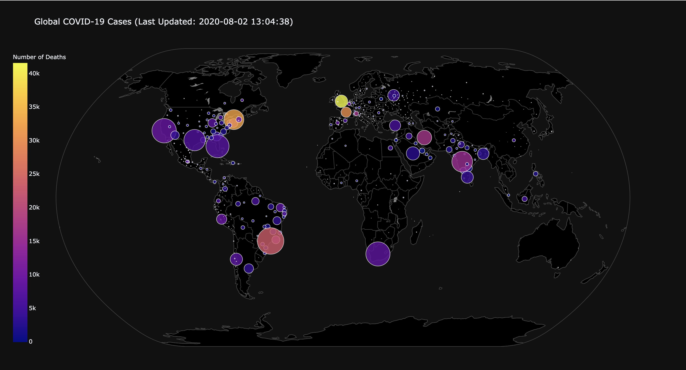

COVID-19 Real-time Data Dashboard 

- Used Python to visualize data collected by John Hopkins University for COVID-19.
- Created a real-time updated stacked bar graph which keeps a track of total number of confirmed, recovered and death cases. 
- Visualized top-10 countries in each category of confimred, recovered and death cases.
- Build a color-cordinated map to visualize worst affected places by the pandaemic.

